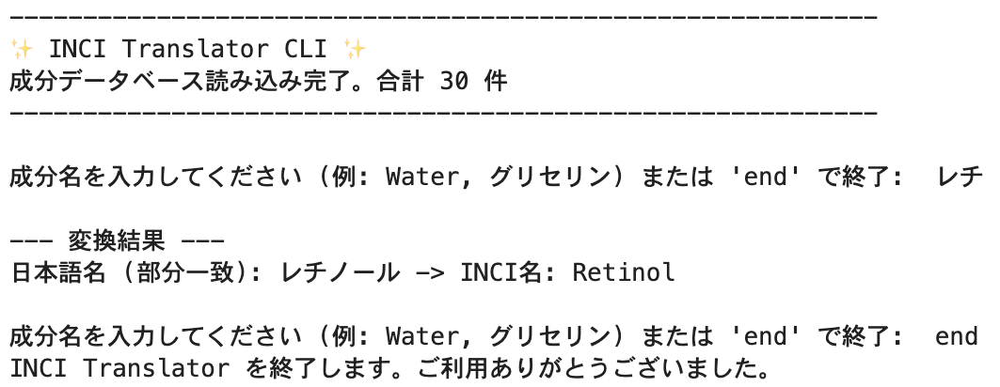

# 🏷️ INCI Translator - 化粧品成分名相互変換CLIツール

## 📸 デモンストレーション

## 🌟 プロジェクト概要
本プロジェクトは、化粧品成分の**INCI名（国際化粧品原料表示名称）**と**日本語名**を相互に変換するためのコマンドラインインターフェース（CLI）ツールです。
ユーザーが成分名の一部を入力するだけで、データベース全体から該当する成分を**あいまい検索（部分一致）**で迅速に探し出し、結果を提示します。

## ⚙️ 技術スタック
* 言語: Python 3.x
* コアライブラリ: `csv`, `os`, `re` (正規表現)
* データ構造: 高速検索のためのPython辞書（`dict`）

## ✨ 主な機能
* CSVファイルからのデータ読み込み: 外部のCSVファイル（`inci_map.csv`）からデータを効率的にロードし、処理します。
* 相互変換: INCI名から日本語名へ、または日本語名からINCI名への双方向の変換に対応しています。
* あいまい検索（部分一致）: ユーザーの入力に対して、成分名の全体でなく、一部（例: "glyce" -> "glycerin"）のみを入力しても、正規表現（`re`モジュール）を用いて該当する全ての候補を返します。
* CLIインターフェース: `while`ループと`input()`関数により、対話型で成分名を連続して入力・検索できる使いやすいインターフェースを提供します。
* 堅牢なファイル処理: ファイルの存在チェックや、UTF-8およびShift-JISエンコーディングの自動判別とエラーハンドリングを実装しています。

## 📂 ファイル構成
* inci_translator.py: プログラム本体。データの読み込み、あいまい検索ロジック、CLIインターフェースを含む。
* inci_map.csv: 成分データ（INCI名と日本語名）を格納するデータベースファイル。
* requirements.txt: プロジェクトの依存ライブラリを記載（今回は標準ライブラリのみ）。

## 🚀 使い方（実行方法）
1. git clone https://github.com/taigo-k/INCI-Translator
2. cd INCI-Translator
3. python inci_converter.py

----- *English Version* -----
# 🏷️ INCI Translator - Cosmetic Ingredient Name Conversion CLI Tool

## 📸 Demonstration

## 🌟 Project Overview
This project is a **Command Line Interface (CLI) tool** designed to mutually convert cosmetic ingredient names between **INCI names (International Nomenclature of Cosmetic Ingredients) and Japanese names**.
By allowing users to input only a part of an ingredient name, the tool utilizes **fuzzy search (partial matching)** to quickly locate and present relevant results from the entire database.

## ⚙️ Tech Stack
* Language: Python 3.x
* Core Libraries: csv, os, re (Regular Expressions)
* Data Structure: Python dictionary (dict) for high-speed lookups.

## ✨ Key Features
* CSV Data Loading: Efficiently loads and processes ingredient data from an external CSV file (inci\_map.csv).
* Mutual Conversion: Supports bidirectional conversion, from INCI name to Japanese name, and vice versa.
* Fuzzy Search (Partial Matching): Uses Regular Expressions (re module) to return all matching candidates even if the user inputs only a partial string (e.g., "glyce" -> "Glycerin"), enhancing user experience.
* CLI Interface: Provides a user-friendly, interactive interface for continuous input and search, utilizing a while loop and the input() function.
* Robust File Handling: Implements file existence checks, automatic character encoding detection between UTF-8 and Shift-JIS, and comprehensive error handling.

## 📂 File Structure
* inci_translator.py: The main program file. Contains data loading, fuzzy search logic, and the CLI interface.
* inci_map.csv: The database file containing ingredient data (INCI names and Japanese names).
* requirements.txt: Lists project dependencies (only standard libraries are used in this case).

## 🚀 Usage (Execution Guide)
1. git clone https://github.com/taigo-k/INCI-Translator
2. cd INCI-Translator
3. python inci_converter.py
