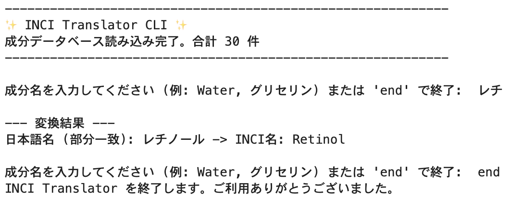

# 🏷️ 化粧品成分名相互変換CLIツール

## 📸 デモンストレーション

## 🧐 開発背景
このツールの開発は、化粧品業界のデータ処理、特に成分情報の取り扱いにおける以下の実務上の非効率性を解決するために着想されました。

1. 長大で複雑なINCI名による非効率な作業
INCI名（International Nomenclature of Cosmetic Ingredients）は、世界共通の成分表示を可能にするシステムですが、その名称は非常に長く複雑であることが一般的です。
   
  * 入力および検索の負荷: 「Sodium Acrylate/Sodium Acryloyldimethyl Taurate Copolymer」のような名称を、データベース検索やドキュメント作成のたびに正確に手動入力またはコピペすることは、実務者にとって大きな負担となります。
  * コピペミスのリスク: 長い成分名のコピペ操作はミスを誘発しやすく、誤った成分情報が製品リストやWebサイトに掲載されるなど、品質管理上の問題につながるリスクがあります。

2. データベース検索の効率の低さ
  * 完全一致検索の限界: 従来のシステムやデータベース検索では、INCI名や日本語名を一文字一句正確に入力しなければ該当する情報にたどり着けないことが多く、名称を完全に覚えていない場合、検索に多大な時間を要します。
  * 形式の壁の非効率性: 日本語名とINCI名という異なる形式を相互に確認する際、複数の資料やデータベースをまたいで検索する手間が発生し、作業の分断が生じる。

## 🌟 プロジェクト概要
本プロジェクトは、化粧品成分の**INCI名（国際化粧品原料表示名称）**と**日本語名**を相互に変換するためのコマンドラインインターフェース（CLI）ツールです。
ユーザーが成分名の一部を入力するだけで、データベース全体から該当する成分を**あいまい検索（部分一致）**で迅速に探し出し、結果を提示します。

## ⚙️ 技術スタック
* 言語: Python 3.x
* コアライブラリ: `csv`, `os`, `re` (正規表現)
* データ構造: 高速検索のためのPython辞書（`dict`）

## ✨ 主な機能
* CSVファイルからのデータ読み込み: 外部のCSVファイル（`inci_map.csv`）からデータを効率的にロードし、処理します。
* 相互変換: INCI名から日本語名へ、または日本語名からINCI名への双方向の変換に対応しています。
* あいまい検索（部分一致）: ユーザーの入力に対して、成分名の全体でなく、一部（例: "glyce" -> "glycerin"）のみを入力しても、正規表現（`re`モジュール）を用いて該当する全ての候補を返します。
* CLIインターフェース: `while`ループと`input()`関数により、対話型で成分名を連続して入力・検索できる使いやすいインターフェースを提供します。
* 堅牢なファイル処理: ファイルの存在チェックや、UTF-8およびShift-JISエンコーディングの自動判別とエラーハンドリングを実装しています。

## 📂 ファイル構成
* inci_translator.py: プログラム本体。データの読み込み、あいまい検索ロジック、CLIインターフェースを含む。
* inci_map.csv: 成分データ（INCI名と日本語名）を格納するデータベースファイル。
* requirements.txt: プロジェクトの依存ライブラリを記載（今回は標準ライブラリのみ）。

## 🚀 使い方（実行方法）
1. git clone https://github.com/taigo-k/INCI-Translator
2. cd INCI-Translator
3. python inci_converter.py

----- *English Version* -----
# 🏷️ INCI Translator - Cosmetic Ingredient Name Conversion CLI Tool

## 📸 Demonstration

## 🧐 Development Background
The development of this tool was conceived to address the following practical inefficiencies in the cosmetic industry's data handling, particularly concerning ingredient information.

1. Inefficient Operations Due to Lengthy and Complex INCI Names
The INCI (International Nomenclature of Cosmetic Ingredients) system is crucial for enabling globally standardized ingredient labeling. However, the names are generally very long and complex.

  * Input and Search Burden: The necessity to manually input or copy-paste names like "Sodium Acrylate/Sodium Acryloyldimethyl Taurate Copolymer" accurately for database searches or document creation imposes a significant burden on practitioners.
  * Risk of Copy-Paste Errors: Copying and pasting lengthy ingredient names is prone to errors. This introduces the risk of misinformation in product lists or websites, leading to potential quality control issues.

2. Low Efficiency in Database Searching
  * Limitation of Exact Match Search: Conventional systems and database searches often require an exact, character-by-character match of the INCI or Japanese name to retrieve relevant information. This consumes considerable time when the user does not recall the full, precise name.
  * Inefficiency of the Format Barrier: The process of cross-referencing different formats (Japanese name vs. INCI name) often necessitates searching across multiple documents or databases, leading to fragmented and inefficient workflow.

## 🌟 Project Overview
This project is a **Command Line Interface (CLI) tool** designed to mutually convert cosmetic ingredient names between **INCI names (International Nomenclature of Cosmetic Ingredients) and Japanese names**.
By allowing users to input only a part of an ingredient name, the tool utilizes **fuzzy search (partial matching)** to quickly locate and present relevant results from the entire database.

## ⚙️ Tech Stack
* Language: Python 3.x
* Core Libraries: csv, os, re (Regular Expressions)
* Data Structure: Python dictionary (dict) for high-speed lookups.

## ✨ Key Features
* CSV Data Loading: Efficiently loads and processes ingredient data from an external CSV file (inci\_map.csv).
* Mutual Conversion: Supports bidirectional conversion, from INCI name to Japanese name, and vice versa.
* Fuzzy Search (Partial Matching): Uses Regular Expressions (re module) to return all matching candidates even if the user inputs only a partial string (e.g., "glyce" -> "Glycerin"), enhancing user experience.
* CLI Interface: Provides a user-friendly, interactive interface for continuous input and search, utilizing a while loop and the input() function.
* Robust File Handling: Implements file existence checks, automatic character encoding detection between UTF-8 and Shift-JIS, and comprehensive error handling.

## 📂 File Structure
* inci_translator.py: The main program file. Contains data loading, fuzzy search logic, and the CLI interface.
* inci_map.csv: The database file containing ingredient data (INCI names and Japanese names).
* requirements.txt: Lists project dependencies (only standard libraries are used in this case).

## 🚀 Usage (Execution Guide)
1. git clone https://github.com/taigo-k/INCI-Translator
2. cd INCI-Translator
3. python inci_converter.py
